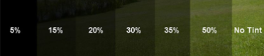

# Window tint

**Los Santos City Limits**\
The front driver and passenger windows must allow a minimum of 50% light to show through.&#x20;

**Blaine** **County Limits**\
The front driver and passenger windows must allow a minimum of 35% light to show through.  The front windshield must not have any tint below the ANSI line.

